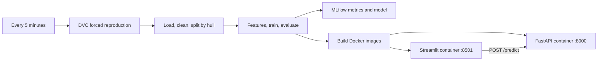

# Hull Lab — yacht resistance MLOps

A complete solution for **PMLDL Assignment 1: Deployment**. A small Extra Trees regressor predicts yacht residuary resistance from hull geometry and speed. The focus is a working, repeatable pipeline: raw data → cleaned splits → trained and tracked model → two running Docker services.



## Quick start

Prerequisites: **Python 3.13**, Git, and **Docker Engine / Docker Desktop running Linux containers**, with Docker Compose v2 supporting `--wait`. Ports 8000 and 8501 must be free. The first installation and image build require internet access and can take several minutes; subsequent runs reuse Docker dependency layers.

```bash
git clone https://github.com/MedvAx-AI/pmldl-yacht-mlops.git
cd pmldl-yacht-mlops
python -m venv .venv
```

Activate the environment on Windows PowerShell:

```powershell
.\.venv\Scripts\Activate.ps1
```

Or on Linux/macOS:

```bash
source .venv/bin/activate
```

Then:

```bash
python -m pip install -r requirements.txt
python scripts/run_pipeline.py --once
```

The raw dataset and DVC project configuration are included. No API keys, DVC remote, GPU, account signup, or manual model download is needed. If PowerShell activation is disabled, call `.\.venv\Scripts\python.exe` directly instead of `python`.

Open:

| Service | Address |
|---|---|
| Web application | http://localhost:8501 |
| Interactive API documentation | http://localhost:8000/docs |
| API health and model identity | http://localhost:8000/health |
| Model metrics, ranges, and lineage | http://localhost:8000/model-info |

Enter the six measurements and select **Predict resistance**. The web application calls the API over the Compose network at `http://api:8000`; it never loads the model itself. Host ports bind to loopback, so the application is available on the machine running Docker.

## Run automatically every five minutes

Choose **one** scheduler. Docker must stay running and the host must stay awake. The initial image build should be completed with `--once` before enabling the schedule.

### Windows Task Scheduler

From PowerShell in the repository:

```powershell
powershell -ExecutionPolicy Bypass -File scripts/install-schedule.ps1
Get-ScheduledTaskInfo -TaskName PMLDL-Yacht-Pipeline
```

This registers a task for the current signed-in user, with its first start one minute later and repeats every five minutes. It persists across terminal closure and works while the user is signed in. Keep Docker Desktop running after login. It does not store a password or run with administrator privileges. To stop future runs:

```powershell
powershell -ExecutionPolicy Bypass -File scripts/remove-schedule.ps1
```

### Portable foreground scheduler

```bash
python scripts/run_pipeline.py
```

Leave this terminal running; Ctrl+C stops the scheduler. Run starts are 300 seconds apart. If a run exceeds the interval, the scheduler waits another full interval instead of accumulating missed jobs. Increase the interval with `--interval 600`; on Windows use `scripts/install-schedule.ps1 -Minutes 10`.

For an unattended Linux installation, use cron with absolute paths (replace `/path/to/repo`):

```cron
*/5 * * * * cd /path/to/repo && /path/to/repo/.venv/bin/python scripts/run_pipeline.py --once >> /path/to/repo/cron.log 2>&1
```

Each invocation executes `dvc repro --force --no-run-cache`, which reruns **all three stages even when inputs have not changed**. A file lock prevents simultaneous runs, including collisions between manual and scheduled invocations. Windows also uses `IgnoreNew` for overlapping starts. Exceptions/nonzero stage exits stop downstream work and appear in the run history; the next scheduled invocation tries again.

Inspect `logs/runs.jsonl` for start times, finish times, durations, and exit codes. Full stage output is in timestamped `logs/*.log` files; the latest 100 are retained. `logs/scheduler.log` rotates. MLflow history is retained locally and grows with each training run. This is a demonstration schedule; disable it when the demonstration is finished to avoid unnecessary training and disk use.

## The three stages

### 1. Data engineering

`code/datasets/prepare.py` reads `data/raw/yacht_hydrodynamics.data`, converts columns to numbers, removes missing/nonfinite rows and duplicates, and filters physically invalid measurements. It splits by the five hull geometry fields using `GroupShuffleSplit(test_size=0.2, random_state=42)`, keeping every speed measurement of a hull on one side of the split.

Outliers in the three dimensional ratios and Froude number are removed from the training partition using outer Tukey fences (`Q1 − 3×IQR`, `Q3 + 3×IQR`) fitted only on training data. Buoyancy and prismatic coefficient are deliberately sparse experimental settings; their uncommon levels are valid hull designs, so frequency-based fences are not applied to them. Test observations and targets are never trimmed using learned thresholds. This ordering prevents test leakage. The original dataset is clean: a correct cleaning stage may remove zero rows. Tests inject missing values, impossible measurements, duplicates, and an extreme outlier to verify the code actually removes them.

Outputs: `data/processed/train.csv`, `data/processed/test.csv`, and `reports/data_quality.json`. On the bundled data, 17 hulls / 238 observations are used for training and 5 hulls / 70 observations for testing.

### 2. Model engineering

`code/models/train.py` adds squared and cubed Froude number features with a scikit-learn `ColumnTransformer`, then fits one `ExtraTreesRegressor` with 80 trees and maximum depth 12. These speed features provide a simple nonlinear representation; preprocessing and the model are saved together as one scikit-learn `Pipeline`.

Held-out metrics: MAE, RMSE, R², and a training-mean baseline RMSE. Training fails before deployment if metrics are invalid or the model does not beat the baseline. Parameters, metrics, an input example, model signature, and the model are logged to **MLflow**. The portable deployment artifact is `models/model.joblib`; `models/metadata.json` records its SHA-256, training time, feature ranges, metrics, and MLflow run ID.

MLflow uses a local SQLite database and local artifact storage. To inspect it, run from the repository root:

```bash
mlflow ui --backend-store-uri sqlite:///mlflow.db --host 127.0.0.1 --port 5000
```

Then open http://localhost:5000 and select `yacht-resistance`. An optional `MLFLOW_TRACKING_URI` environment variable can point training at another tracking server.

The model predicts on the source dataset's dimensionless target scale. Results on five held-out hulls are a small educational evaluation, not evidence of performance on arbitrary ship families. Inputs outside observed training ranges produce a visible warning.

### 3. Deployment

`code/deployment/deploy.py` builds the API and app images, then runs `docker compose up -d --force-recreate --wait`. The trained model and metadata are **baked into the API image**. Both services run as non-root users with health checks and bounded container logs.

Deployment verifies a real prediction, Streamlit health, communication from the app container to the API, and equality of the served model SHA-256 **and MLflow run ID** with the current training artifacts. Evidence is saved in `reports/deployment.json`. Training and image build failures leave existing containers running. Replacing containers causes a brief interruption; this assignment implementation is not a zero-downtime deployment or automatic rollback system.

## Repository layout

```text
code/
  datasets/prepare.py
  models/train.py
  deployment/
    api/                 # FastAPI, requirements and Dockerfile
    app/                 # Streamlit, requirements and Dockerfile
    deploy.py
    docker-compose.yml
data/
  raw/                   # Included 11 KB UCI dataset and provenance
  processed/             # Generated train/test CSVs
models/                  # Generated model package and metadata
reports/                 # Generated metrics, cleaning and deployment evidence
scripts/                 # Pipeline runner and Windows scheduling scripts
tests/                   # Data, model/API and UI tests
docs/                    # Requirements mapping and demonstration guide
.github/workflows/ci.yml  # Real three-stage pipeline on an Ubuntu runner
dvc.yaml                 # Three-stage dependency graph
dvc.lock                 # Last reproduced dependency hashes
requirements.txt         # Pinned direct dependencies
requirements-model.txt   # Identical model dependencies for training and API
```

Generated data, models, logs, and MLflow storage are excluded from Git and regenerated on each run. DVC outputs use `cache: false` because the data is tiny, raw data is included, and no external cache should be needed for a TA to reproduce the project. Direct dependency versions are pinned; transitive dependencies and the Python base-image patch release may receive updates. No Airflow directory is necessary because this project uses DVC.

## Verification and demonstration

```bash
python -m pytest -q
dvc dag
docker compose -f code/deployment/docker-compose.yml ps
```

Run the pipeline before tests so the model artifact exists. GitHub Actions installs dependencies, executes all three stages with real Docker containers, runs the tests, and uploads reports and logs. CI runs on push/PR/manual dispatch; the five-minute deployment schedule runs on your persistent local host, since a hosted Actions runner disappears after its job.

See [the TA demonstration checklist](docs/DEMO.md), [requirement-by-requirement mapping](docs/REQUIREMENTS.md), and [verification evidence](docs/VERIFICATION.md).

To stop services after disabling the scheduler:

```bash
docker compose -f code/deployment/docker-compose.yml down
```

## Data provenance and references

Gerritsma, J., Onnink, R., & Versluis, A. (1981). **Yacht Hydrodynamics** [Dataset]. UCI Machine Learning Repository. [DOI: 10.24432/C5XG7R](https://doi.org/10.24432/C5XG7R). The 308 observations cover 22 hull forms. The original file is redistributed unchanged under [CC BY 4.0](https://creativecommons.org/licenses/by/4.0/); processed splits are generated adaptations. See [data/raw/README.md](data/raw/README.md).

Implementation references: [DVC forced reproduction](https://doc.dvc.org/command-reference/repro), [MLflow scikit-learn model logging](https://mlflow.org/docs/latest/api_reference/python_api/mlflow.sklearn.html), [Docker Compose startup and health waiting](https://docs.docker.com/reference/cli/docker/compose/up/).
